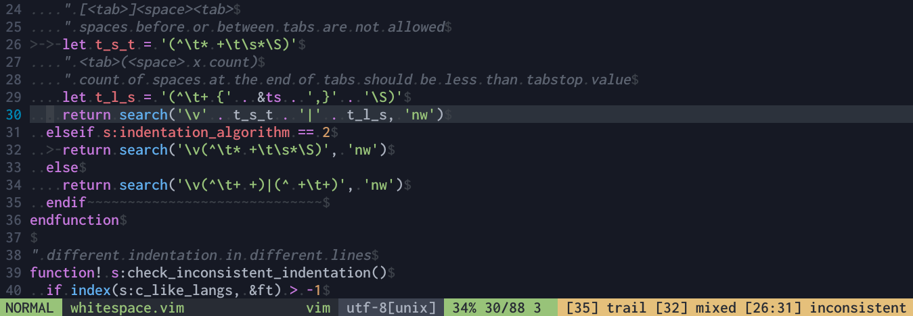

### Description

This plugin is [vim-airline](https://github.com/vim-airline/vim-airline)'s [whitespace](https://github.com/vim-airline/vim-airline#whitespace) extension ported to [lightline](https://github.com/itchyny/lightline.vim). It provides indication of trailing whitespace, mixed indentation and inconsistent indentation.



### Table Of Contents

- [Installation](#installation)
- [Integration](#integration)
- [Configuration](#configuration)

### Installation

Install using a plugin manager of your choice, for example:

```viml
call dein#add('deponian/vim-lightline-whitespace')
```

### Integration

1. Register the component:

```viml
let g:lightline.component_expand = {'whitespace': 'lightline#whitespace#check'}
```

2. Set color to the component (use `warning` or `error`):

```viml
let g:lightline.component_type = {'whitespace': 'warning'}
```

3. Add the component to the lightline, for example to the right side:

```viml
let g:lightline.active = { 'right': [[ 'whitespace' ]] }
```

### Configuration

##### `g:whitespace#max_lines`
> Max number of lines in file where whitespace checking is enabled.
>
> Default: `20000`

##### `g:whitespace#space`
> Separator between trail/mixed/inconsistent indicators.
>
> Default: `" "`

##### `g:whitespace#trailing_format`
> Format of trailing whitespace indicator. `%s` will be replaced with line number.
>
> Default: `"[%s] trail"`

##### `g:whitespace#mixed_format`
> Format of mixed indentation indicator. `%s` will be replaced with line number.
>
> Default: `"[%s] mixed"`

##### `g:whitespace#inconsistent_format`
> Format of inconsistent indentation indicator. `%s` will be replaced with line range.
>
> Default: `"[%s] inconsistent"`

##### `g:whitespace#skip_check_ft`
> Disable specific whitespace checks for individual filetypes.
>
> Default: `{}`
>
> Vim-airline's default: `{'make': ['mixed', 'inconsistent']}`

##### `g:whitespace#c_like_langs`
> Which filetypes have special treatment of /* */ comments, matters for inconsistent indentation algorithm.
>
> Default: `[]`
>
> Vim-airline's default: `[ 'arduino', 'c', 'cpp', 'cuda', 'go', 'javascript', 'ld', 'php' ]`

##### `g:whitespace#indentation_algorithm`
> Customize the type of mixed indent checking to perform.
>
> Algorithm 0: must be all spaces or all tabs before the first non-whitespace character
>
> Algorithm 1: certain number of spaces are allowed after tabs, but not in between this algorithm works well for /* */ style comments in a tab-indented file
>
> Algorithm 2: spaces are allowed after tabs, but not in between this algorithm works well with programming styles that use tabs for indentation and spaces for alignment
>
> Default: `0`

### Acknowledgements
Thanks to authors of original whitespace extension from [vim-airline](https://github.com/vim-airline/vim-airline) plugin.

Also thanks to [@maximbaz](https://github.com/maximbaz) and his [lightline-trailing-whitespace](https://github.com/maximbaz/lightline-trailing-whitespace) repository which I used as a reference.
